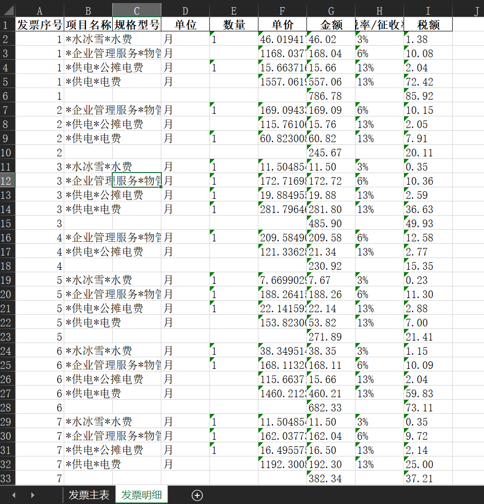

# 项目简介

本项目是一个基于 PaddleOCR 的自动识别发票内容，导出Excel。



## 功能特点
- **发票 OCR 识别**：利用 PaddleOCR 技术，实现对发票图片的文字识别，支持多种发票类型。
- **数据清洗**：对识别出的文字进行清洗，去除噪声和异常值，确保数据质量。
- **Excel 导出**：将处理后的数据导出为 Excel 格式，方便用户查看和分析。

## 技术栈
- **后端**：Flask 框架
- **前端**：HTML、CSS、JavaScript
- **OCR 识别**：PaddleOCR
- **数据处理**：Python 语言

## 安装与运行
安装docker环境，运行项目
```bash
sh build.sh
```
体验地址：http://zhiwei3306.com/fapiao
本地访问地址：http://localhost/fapiao

目前只测试了标准的发票文件，对于手拍的文件或者其他文件，暂未测试过
未来如果有提供数据的，可以尝试进一步优化

目前使用的服务器性能有限，所以处理速度较慢，一个文件10s左右，请耐心等待
欢迎交流
