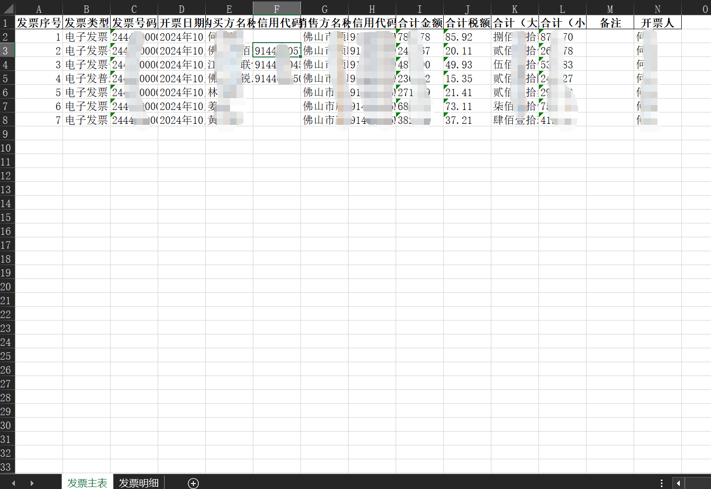
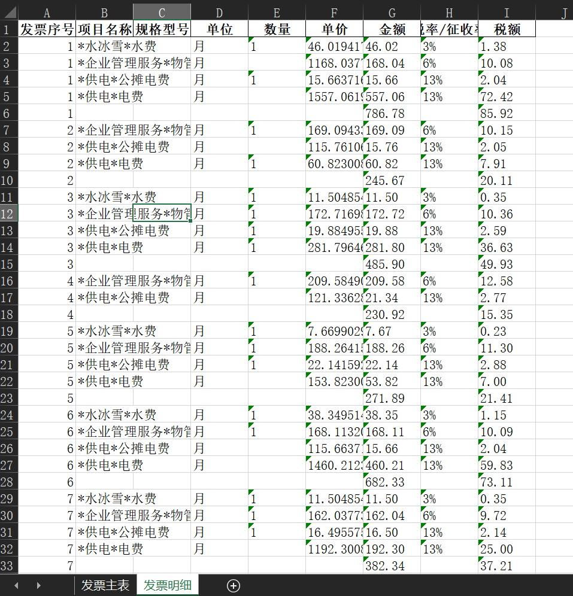

# 项目简介

本项目是一个基于 PaddleOCR 的自动识别发票内容，导出Excel。




## 功能特点
- **电子发票 PDF 直接读文本层**：税务系统生成的电子发票 PDF 自带精确的文字和坐标，直接读取，不经过 OCR，单张几十毫秒、不会认错字。
- **图片/扫描件 OCR 识别**：没有文本层的扫描件、图片（jpg、png、bmp）用 PaddleOCR 识别。
- **金额交叉校验**：明细金额之和与合计、合计+税额与价税合计、大写与小写金额、数量×单价与金额相互核对；
  不一致或字段缺失、格式异常时，在 Excel 的「复核提示」列写明原因，提醒人工核对。
- **Excel 导出**：发票主表 + 商品明细两个工作表。

## 技术栈
- **后端**：Flask 框架
- **前端**：HTML、CSS、JavaScript
- **OCR 识别**：PaddleOCR
- **数据处理**：Python 语言

## 安装与运行

### 方式一：Docker（推荐用于部署）
安装docker环境，运行项目
```bash
sh build.sh
```
体验地址：http://zhiwei3306.com/fapiao
本地访问地址：http://localhost:80/fapiao
具体功能介绍文章：https://mp.weixin.qq.com/s/dMCdKKOAvlYM8u8h2hiJTw

### 方式二：Windows 一键启动（双击运行）
1. 在 [Releases](https://github.com/zhiweiiii/fapiao-ocr-excel/releases) 页面下载最新的 `fapiao-ocr-windows-*.zip`（或直接 clone 本仓库）
2. 解压到**纯英文路径**（如 `D:\fapiao-ocr`），电脑需已安装 64 位 Python 3.9 ~ 3.13
3. 双击 `start.bat`：首次运行会自动创建虚拟环境并安装依赖（5~20 分钟），之后双击即可秒开，并自动打开浏览器

详见压缩包内的 `README_Windows.txt`。发布新版本：推送 `v*` 格式的 tag，或在 GitHub 的 Actions 页面手动运行「Windows 发布包」并填写版本号（如 `v1.0.1`）。GitHub Actions 会自动打包、在 Windows 环境中实际安装运行并识别示例发票，测试通过后发布到 Releases。

### 方式三：本地直接运行（不使用 Docker）
模型权重文件已经放在仓库的 `module/` 目录下，不需要额外下载，只需要装好 Python 依赖即可。

```bash
python3 -m venv .venv
source .venv/bin/activate       # Windows: .venv\Scripts\activate

# 安装依赖（paddleocr 体积较大，第一次安装会比较慢）
pip install -r requirements.txt
# paddleocr 依赖 paddlepaddle，需要单独安装（请固定 3.1.1，3.3.x 在 CPU 上会报错）：
pip install paddlepaddle==3.1.1 # 如果有 GPU，请参照 https://www.paddlepaddle.org.cn/ 安装对应的 paddlepaddle-gpu

# 启动服务（默认监听 80 端口，Linux 上非 root 用户监听 80 端口可能需要权限；
# 可以用 PORT 环境变量换成其他端口，比如本地开发常用的 8080）
PORT=8080 python3 main.py
```
启动后访问 http://localhost:8080/fapiao 即可使用。

### 运行测试
```bash
pip install -r requirements-dev.txt

# 单元测试 + PDF 文本层回归测试（不需要 OCR 模型，几秒内跑完；每个 PR 都会在 CI 中自动运行）
pytest tests/test_main_helpers.py tests/test_extract_invoice_info.py tests/test_pdf_text.py
```

## 识别准确率

`tests/eval/eval_accuracy.py` 会把每张测试发票的识别结果与人工标注的真值逐字段比对：

```bash
python -m tests.eval.eval_accuracy                  # 与线上一致：PDF 优先读文本层，图片走 OCR
python -m tests.eval.eval_accuracy --source ocr     # 全部强制走 OCR
python -m tests.eval.eval_accuracy --source text    # 只评估 PDF 文本层（不需要 OCR 模型）
python -m tests.eval.eval_accuracy --verbose        # 打印每个识别错误的字段
```

测试集：`data/` 下的真实发票 1 张，以及 `tests/eval/synthetic/` 下按真实版式生成的合成发票 7 张
（单行/多行明细、规格单位、品名换行、专票长名称带备注、折扣行、无数量单价），
另外由合成发票渲染出扫描图、模拟手机拍照（倾斜 3°+模糊+压缩）、旋转 90° 的图片。

| 输入类型 | 主表字段 | 明细字段 |
|---|---|---|
| 电子发票 PDF（8 张，文本层） | 100% | 100% |
| 清晰扫描图（2 张，OCR） | 100% | 100% |
| 模拟手机拍照（2 张，OCR） | 约 54% | 约 13% |
| 旋转 90°（1 张，OCR） | 约 15% | 约 25% |

注意：合成发票比真实发票干净，以上数字应视为标准电子发票的上限；纸质专票、其他票种尚未测试。
手机拍照和旋转图片目前基本不可用（同一行文字因倾斜被拆到不同行），但会在「复核提示」列中标出问题。

**欢迎提供真实发票样本**：放到 `data/` 下，附同名 `.json` 真值（格式参考 `data/电票1.json`），
即可自动纳入准确率评估和回归测试。

目前使用的服务器性能有限，所以处理速度较慢，一个文件10s左右，请耐心等待
欢迎交流
